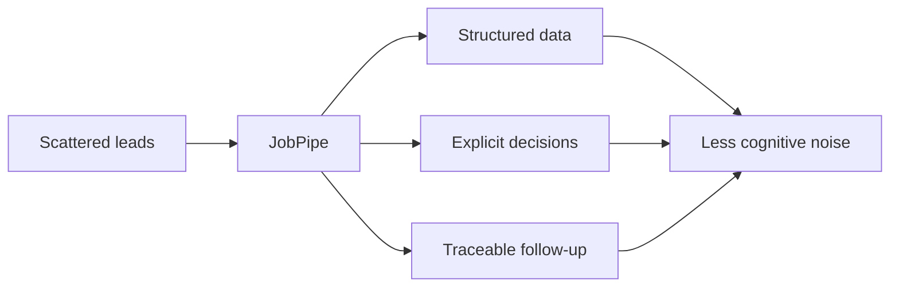

# Hi, I'm Lars

Digital delivery, service improvement, change management, and product/service ownership.

Work focus: improving how organization, technology, services, and people fit together — turning fragmented manual processes into clearer ownership, practical workflows, and change that holds up in daily operations.

## What I do

- Improve real workflows, not just documentation around them
- Turn complexity into usable structure and decision support
- Translate between business, operations, technical teams, leaders, and users
- Build traceable processes with clear ownership and follow-through
- Use AI pragmatically as a workflow tool

## Current public project

**JobPipe** is a local-first job-search intelligence system built to reduce cognitive noise.

It turns scattered leads, vague fit signals, and follow-up uncertainty into structured data, explicit decisions, and traceable workflows. The point is not to automate more activity. The point is to reduce noise, keep fewer loose threads open, and make better decisions.

## System map

JobPipe is a single-user OSS project in active hardening, not a launched SaaS product.

## Related workflow tooling

JobPipe is the public data and decision layer in a small personal workflow system. Around it, I use **JobSane** for CrewAI-powered application workflow automation, and **JobVibe** for development support, GitHub workflow, and project management.

The system also integrates with external MIT-licensed tools such as JobSync and React Resume where they fit the workflow.

## Background signals

- 7 years as IT and E-commerce Advisor, product owner, and project lead in European digital operations across 12 countries
- Cross-functional consulting experience with CRM, martech, customer data, and digital customer experience
- Executive Master of Management at Handelshøyskolen BI, completing in June 2026, focused on strategic business development, innovation, market strategy, and change management
- Norwegian native speaker, fluent English

## Direction

Looking for my next role in digital delivery, service improvement, product/service ownership, workflow design, digital transformation, or structured change.

Best fit: work where services, systems, people, and decisions need to fit together better — especially across business, operations, technical teams, leaders, and users.

Relevant titles may include Product Owner, Service Owner, Change Manager, Digitalization Lead, Digital Project Manager, Senior Advisor, Platform Owner, Program Manager, or Domain Lead.

Based in Arendal, Norway, and open to relevant opportunities across Southern Norway, Oslo, and elsewhere in Norway. Location is flexible where the role is a strong fit.
